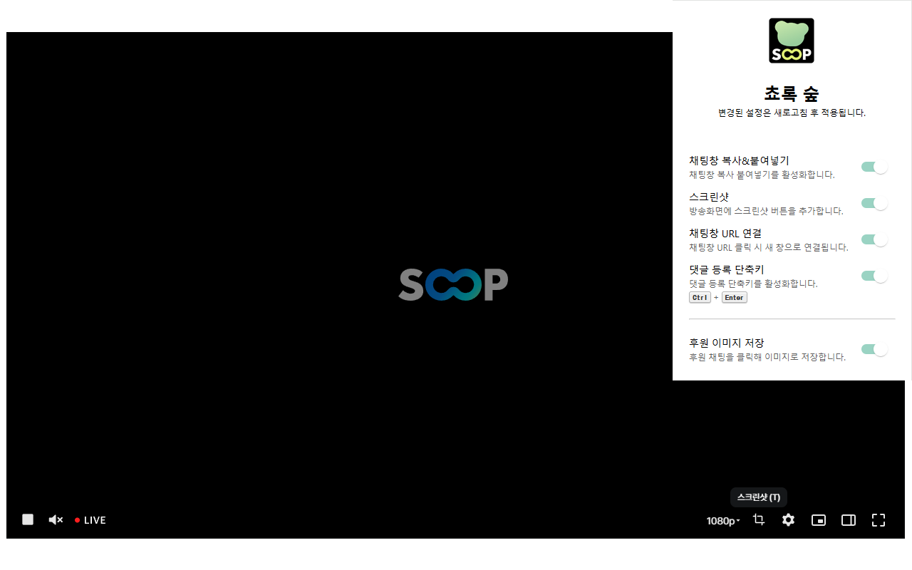

	
	<h3 align="center">쵸록 숲(Chorok SOOP)</h3>

	SOOP 편의기능 서비스

 

## 쵸록 숲

SOOP의 기능을 보조하는 크롬 확장 프로그램(Chrome Extension)입니다.

## 사용 방법

#### 1. 크롬 확장 프로그램 다운로드
- [크롬 웹 스토어에서 추가하기](https://chromewebstore.google.com/detail/%EC%B5%B8%EB%A1%9D-%EC%88%B2/hannhmpalclmeijjbncdonchgmmkpkjn)

#### 2. 설치된 확장 프로그램에서 원하는 기능을 선택 후 새로고침

## 기술의 범위
- javascript만으로 작성된 내용으로, 모든 설정은 사용자 브라우저의 로컬 영역에 저장되며, 캡처 기능을 통한 파일 저장을 제외한 __외부 저장 공간에 대한 어떠한 액세스도 수행하지 않습니다.__
- 레이아웃의 변경 및 단축키 등록에 관련한 작업만 수행하는 크롬 확장 프로그램으로, __어떠한 정보도 외부에 수집되지 않습니다.__
  
## [ 버그 제보 및 기능 기여 ]
쵸록 숲은 오픈소스로 개발되고 있습니다.
기능 제안 및 개발 기여 모두 적극적으로 받고있습니다.
- https://github.com/SnorlaxH/chorok-soop

## [ 안내 ]
이 확장 프로그램은 숲(www.sooplive.co.kr) 와 관련이 없습니다.

## 업데이트 기록

### v1.2.5
- 오류 수정

### v1.2.4
- SOOP 채널(방송국) UI 변경에 따른 수정

### v1.2.3
- VOD 자동 재생 ON/OFF

### v1.2.1
- 빨리 감기 기능 추가
- 지연 시간 추가

### v1.2.0
- 클립 및 캐치에서 캡쳐 버튼 동작 수정(단축키 불가)
- 클립 및 캐치 다운로드 기능 추가

### v1.1.0
- 이모티콘 복사 선택영역만 복사되게 수정
- 자동 UP기능 방식 수정

### v1.0.9
- 자동 UP기능 추가
- 오디오 컴프레서 부분 수정

### v1.0.8
- 대시보드 채팅 팝업에서 동작하지 않는 현상 수정

### v1.0.7
- 대시보드에서 기능 동작 오류 수정
- 스크린샷 파일명 형식 수정

### v1.0.6
- 오류수정

### v1.0.5
- 후원 이미지 저장 기능 오류 수정
- 대시보드에서도 기능 동작하게 추가

### v1.0.4
- 오디오 컴프레서 추가
- 메시지창에서 이모티콘 복사 기능 추가

### v1.0.3
- VOD 스크린샷 오류 수정
- 후원 메시지 숨기기 기능 추가

### v1.0.2
- 댓글 수정시에도 단축키 가능하게 수정
- 채팅창 링크 연결 시 이모지 사라지는 버그 수정
- VOD 스크린샷 기능 추가

### v1.0.1
- 채팅창 링크 연결 오류 수정

### v1.0.0
SOOP의 채팅창 기능 추가 및 방송화면 스크린샷 등 편의성 기능을 추가한 크롬 확장 프로그램입니다.
쵸록 숲은 다음과 같은 기능을 제공합니다.
- 채팅 입력 창 복사 및 붙여넣기
- 스크린샷 버튼을 방송화면에 추가합니다(단축키 : T)
- 채팅창 URL 연결(채팅창에 URL양식을 찾아 클릭 시 창이 열리는 기능을 제공합니다.
- 댓글 등록 단축키(Ctrl + Enter)를 눌러 간편하게 댓글 등록을 할 수 있습니다.

Copyrightⓒ snorlaxh. All rights reserved. Inspired by SOOP Streamer tachocho.

